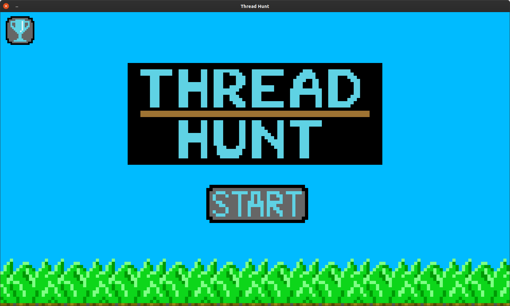
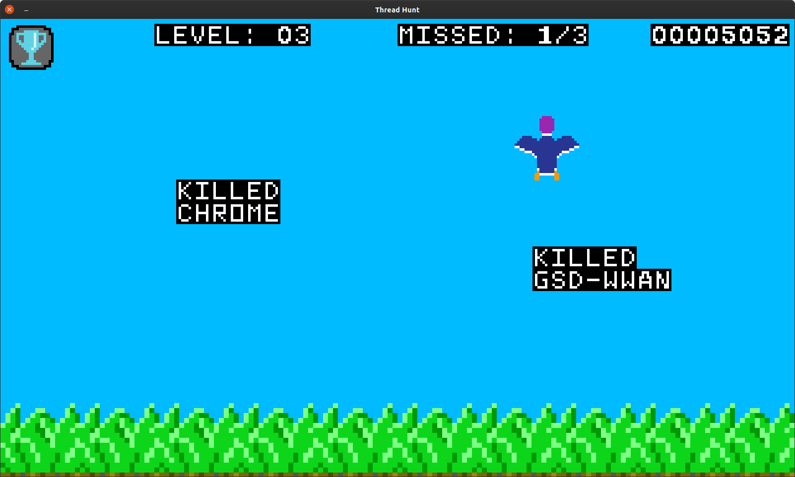
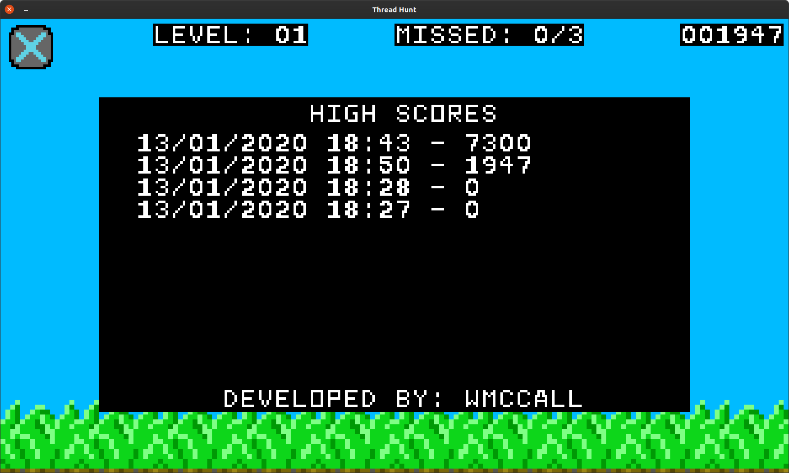
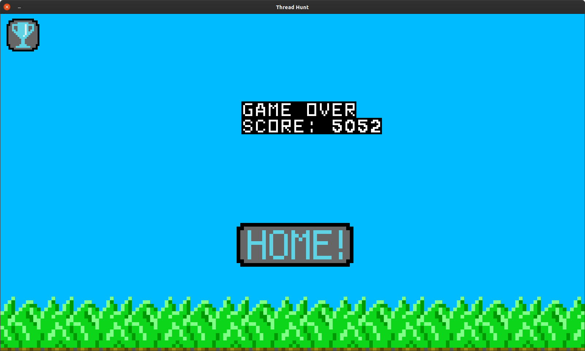

# ThreadHunt

Why play regular old duck hunt when you could be killing threads in your userspace at the same time?

## How to Play
* Run `run.sh` to install prerequisites and run the program
* After starting the game, click on ducks to kill them
  * Your score is based off of the killed process ID
  * Your game may end abruptly if a critical process dies, your score will be saved however
* Miss 3 ducks and your game will end and display your bloodthirsty score

## Photos

Home

In Game

High Scores

End Game
